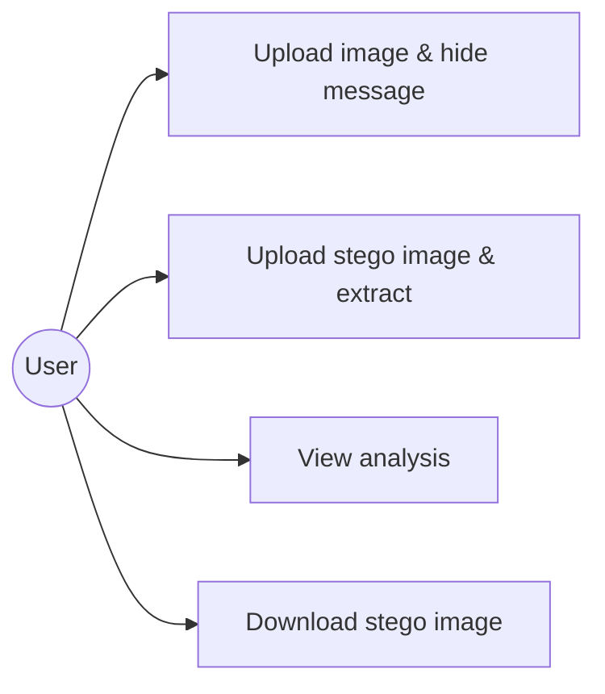

# Use Case Diagram

```mermaid
flowchart LR
    U((User))
    U --> H[Upload image & hide message]
    U --> E[Upload stego image & extract]
    U --> A[View analysis]
    U --> D[Download stego image]
```

## Aktor
User

## Use case
1. Menyembunyikan pesan.
2. Mengekstraksi pesan.
3. Mengunduh stego image.
4. Melihat analisis metrik.
