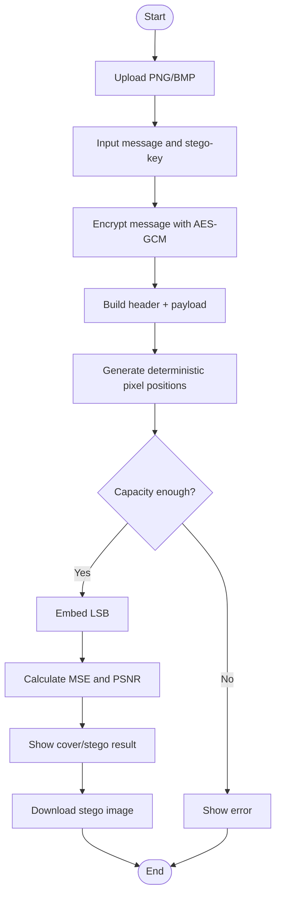

# Activity Diagram

```mermaid
flowchart TD
    A([Start]) --> B[Upload PNG/BMP]
    B --> C[Input message and stego-key]
    C --> D[Encrypt message with AES-GCM]
    D --> E[Build header + payload]
    E --> F[Generate deterministic pixel positions]
    F --> G{Capacity enough?}
    G -- No --> X[Show error]
    G -- Yes --> H[Embed LSB]
    H --> I[Calculate MSE and PSNR]
    I --> J[Show cover/stego result]
    J --> K[Download stego image]
    K --> L([End])
    X --> L
```
