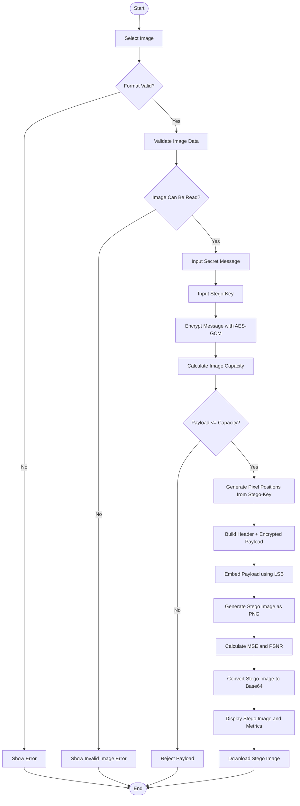
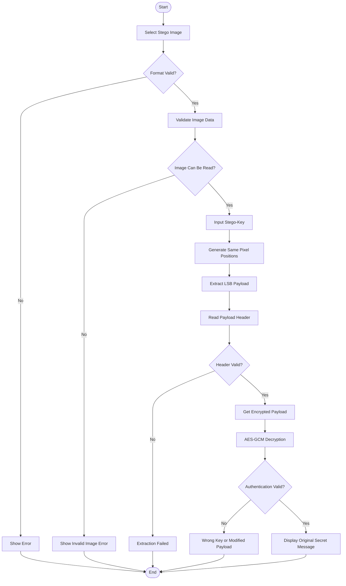
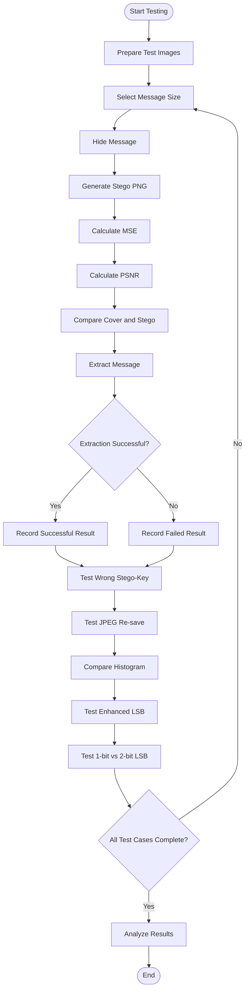

# Flowchart SecretPic

## 1. Hide Message



## 2. Extract Message



## 3. Alur Pengujian



## 4. Format Gambar yang Didukung

SecretPic menerima file dengan ekstensi:

- `.png`
- `.bmp`
- `.jpg`
- `.jpeg`
- `.img`

### Catatan penting tentang `.img`

Ekstensi `.img` dapat digunakan oleh berbagai jenis file dan tidak selalu merupakan file gambar yang dapat dibaca oleh Pillow. Oleh karena itu, aplikasi harus melakukan validasi isi file, bukan hanya memeriksa ekstensi.

File akan diproses hanya jika Pillow berhasil membacanya sebagai citra.

## 5. Perubahan pada `app.py`

Gunakan daftar ekstensi berikut:

```python
ALLOWED = {"png", "bmp", "jpg", "jpeg", "img"}
```

Fungsi validasi ekstensi:

```python
def allowed_file(filename):
    return (
        "." in filename
        and filename.rsplit(".", 1)[1].lower() in ALLOWED
    )
```

Karena `.img` tidak selalu merupakan format gambar standar, tambahkan validasi isi:

```python
from PIL import Image
import io

def valid_image_content(file_bytes):
    try:
        with Image.open(io.BytesIO(file_bytes)) as img:
            img.verify()
        return True
    except Exception:
        return False
```

Setelah file dibaca:

```python
original = image.read()

if not valid_image_content(original):
    flash(
        "File bukan gambar yang valid atau format gambar tidak didukung.",
        "error"
    )
    return redirect(url_for("hide"))
```

Lakukan validasi yang sama pada halaman `extract`.

## 6. Perubahan pada `hide.html`

Gunakan:

```html
<input
    type="file"
    name="image"
    accept=".png,.bmp,.jpg,.jpeg,.img"
    required
>
```

Keterangan:

```html
<p class="muted">
    Format yang didukung: PNG, BMP, JPG, JPEG, dan IMG.
    Hasil steganografi disimpan sebagai PNG agar data LSB tetap terjaga.
</p>
```

## 7. Perubahan pada `extract.html`

Gunakan:

```html
<input
    type="file"
    name="image"
    accept=".png,.bmp,.jpg,.jpeg,.img"
    required
>
```

Keterangan:

```html
<p class="muted">
    Format input yang diterima: PNG, BMP, JPG, JPEG, dan IMG.
    Stego image hasil proses utama disimpan sebagai PNG.
</p>
```

## 8. Konversi dan Output Stego

Input:

```text
PNG
BMP
JPG
JPEG
IMG (jika dapat dibaca sebagai citra)
```

Diproses menjadi:

```text
RGB Image
   |
   v
AES-GCM Encryption
   |
   v
LSB Embedding
   |
   v
Stego PNG
```

Output utama tetap **PNG** agar bit LSB tidak berubah akibat kompresi lossy seperti JPEG.

## 9. Ringkasan

Alur utama aplikasi:

```text
Upload Image
     |
     v
Validate Extension
     |
     v
Validate Image Content
     |
     v
Encrypt Secret Message
     |
     v
Check Capacity
     |
     v
Generate Pixel Positions
     |
     v
LSB Embedding
     |
     v
Stego PNG
     |
     +----> MSE
     |
     +----> PSNR
     |
     v
Preview + Download
```
